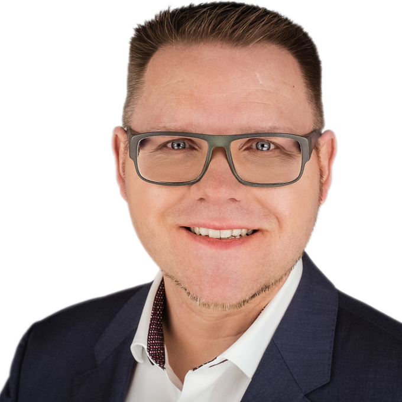

{#id .picture}

## Persönliche Daten

Name
: Henry Stadthagen

Geburtsdaten
: 01.01.1973 in Stralsund

Adresse
: Wilhelm – Leuschner – Strasse 6
64347 Griesheim

Telefon
: [0151 651 61444](tel:+4915165161444)

E-Mail
: [h.stadthagen@me.com](mailto:h.stadthagen@me.com)

Webseite
: [henrystadthagen.de](https://henrystadthagen.de)

## Berufserfahrung

Seit 01/2024 - heute
: **Aareal Bank AG, Wiesbaden**  
Manager, DevOps Engineer

    * Lifecycle Managment und Onboarding von Backend Apps auf einer RedHat OpenShift Platform mit ArgoCD, DevOps Engineer
    * Entwicklung und Betrieb von Container-basierten Anwendungen mit Docker und Kubernetes/RedHat OpenShift
    * Implementierung, Konfiguration und Management CI/CD Pipelines mit GitLab CI

02/2022 - 12/2023
: **ti&m GmbH, Frankfurt am Main**  
Senior Consultant, DevOps Engineer

    * Technischer Consultant für eine Middleware Lösung mit den Tools, RedHat Openshift, Docker, Grafana, Prometheus, Jenkins, Sonarqube, Bitbucket, Atlassin Jira im Versicherungsumfeld
    * Onboarding von Backend Apps auf einer RedHat OpenShift Platform mit ArgoCD, DevOps Engineer

02/2020 - 02/2022
: **CGI Deutschland B.V. & CO. KG, Sulzbach (Taunus)**  
Senior Consultant, DevOps Engineer

    * Konzeption und Implementierung einer zentralen Testinfrastruktur mit den Tools Docker, Grafana, Prometheus, Jenkins, Sonartype Nexus, Sonarqube, GitLab CI, Atlassin Jira und Smartbear Zephyr im Public Umfeld
    * Change und Release Manager mit den Tools Atlassin Jira, Confluence und BMC Remedy ITSM im Public Umfeld

02/2019 - 02/2020
: **Sabbatical**  

    * Persönliche Weiterbildung

06/2011 - 07/2015
: **GCON GmbH, Darmstadt**  
IT-Consultant

    * Design- /Architekturberatung für den Einsatz von Microsoft Produkten
    * Requirements Managment
    * Weiterentwicklung von Deployment Prozessen
    * Evaluierung und Test neuer Hard- und Software für den Einsatz im Retail-IPOS Bereich

06/2011 - 07/2015
: **Deutsche Telekom AG, Darmstadt**  
Bereich Product & Innovation  

    * Erfolgreiche Leitung eines Projeks
    * Persönliche Weiterbildung

## SCHULISCHE UND BERUFLICHE AUSBILDUNG

08/2008 - 06/2011
: **Firma 1** (Ort)
Titel
\

1998 - 2008
: **Schule** (Ort)  
Abschluss

## IT-SKILLS UND ZERTIFIZIERUNGEN

**IT-Zertifizierungen**
: 07/19	Certified Scrum Product Owner 
07/19	Certified Scrum Master
12/14	Update MCSA 2008 Microsoft Certified Systems Administrator
08/09	ITIL v3
11/03 – 09/04	MCT Microsoft Certified Trainer
09/02 – 12/02	CNE 6 Certified Novell Engineer
05/01 – 06/01	CCI Certified Citrix Instructor
12/00 – 05/01	CCA Certified Citrix Administrator
03/00 – 12/00	CNE 5 Certified Novell Engineer
08/99 – 03/00	MCSE Microsoft Certified Systems Engineer

## Sonstige Kenntnisse

Netzwerktechnik
: OSPF, Firewalls, Radius, SIP, IPv6, PXE, VPN

Virtualisierung
: VMware ESXi, vCenter, Hyper-V, Proxmox

Tools
: Atlassin Jira / Confluence
    MARS (telekominternes Ticketingtool)
    ServiceNow
    Gitlab CI
    HashiCorp Terraform
    Jenkins
    ArgoCD
    Kubernetes
    Docker
    RedHat Openshift
    Prometheus, InfluxDB, Grafana

Betriebssysteme
: Microsoft Windows Server 2000/2003/2008/2016
    Microsoft Windows NT, 2000, XP, 7, 8, 10, 11
    Linux Ubuntu, Debian
    Apple Mac OS X 10.1 – 15.x

Scripting
: Bash, PowerShell

Seminare
: jährliche Schulungen in den Bereichen eLarning Compliance, Datenschutz,	Disastermanagement

## WEITERE KENNTNISSE UND HOBBIES

Sprachen
: Deutsch (Muttersprache), Englisch

Führerschein
: Klasse A, B, C1, C1E, CE

Freizeit
: ehrenamtlich arbeite ich als freier Fotograf
für die Hochschule Stralsund 
    UAV Pilot mit Kenntnisnachweis § 21a Abs. 4 Satz 3 Nr. LuftVO 

